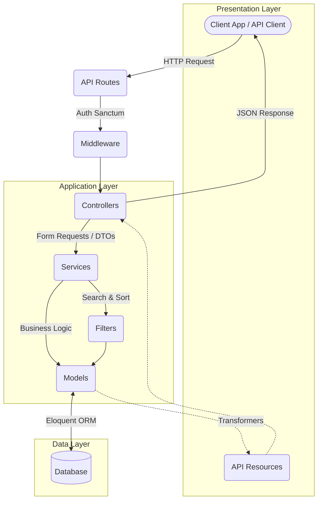
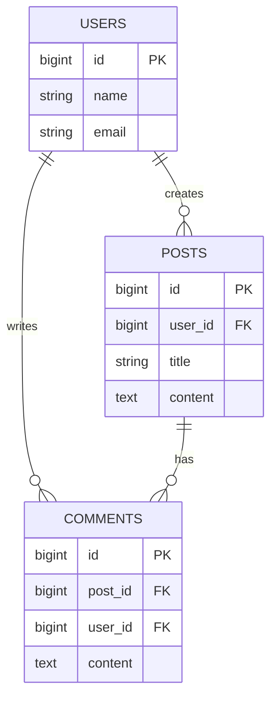

<div align="center">

# 🚀 Laravel Enterprise RESTful Blog API

[](https://laravel.com)
[](https://php.net)
[](https://www.mysql.com/)
[](https://www.postman.com/)

A production-ready, industry-standard RESTful Blog API designed to showcase **Enterprise-level Architecture**.

</div>

---

## 🌟 Why This Project Stands Out (Core Architecture)

This is completely a **Headless API**. All frontend scaffolding, Blade views, and node/npm packages have been disregarded to design a pure, high-performance backend service. It is engineered applying strict **Software Engineering Principles** suited for scalable enterprise software:

* **Thin Controllers & Fat Services:** Controllers act merely as routing mechanisms. Complex business logic is completely isolated into testable, decoupled **Service Classes**.
* **Data Transfer Objects (DTOs):** Incoming arrays are mapped to strictly-typed custom Objects before hitting Services, ensuring perfect data integrity and preventing unpredictable state bugs.
* **The Filter Pattern:** Database query parameterization (`?search=foo&sort=desc`) is abstracted into extendable class-based filters rather than cluttering controllers.
* **Predictable API Responses:** Utilizing a custom `ApiResponser` Trait alongside **Laravel API Resources** ensures that frontend clients receive a uniform JSON structure every single time, safely omitting sensitive DB columns.
* **Advanced Security:** Fully stateless token authentication using **Laravel Sanctum**. Ownership restrictions (E.g., Only the author can delete their post) are natively enforced via **Eloquent Policies**.

---

## 📦 System Requirements

* **PHP** ^8.3+
* **Composer**
* **MySQL / PostgreSQL / SQLite**

---

## 🛠️ Installation & Setup

1. **Clone the repository:**
   ```bash
   git clone <your-repository-url>
   cd blogapi
   ```

2. **Install dependencies:**
   ```bash
   composer install
   ```

3. **Environment Setup:**
   ```bash
   cp .env.example .env
   php artisan key:generate
   ```

4. **Database Setup (Update your `.env` with DB credentials first):**
   ```bash
   php artisan migrate --seed
   ```

5. **Start the local server:**
   ```bash
   php artisan serve
   ```

---

## 📖 API Endpoints Quick Reference

> 💡 **For a complete deep-dive into request/response shapes, headers, and payloads, please see the [API_DOCUMENTATION.txt](./API_DOCUMENTATION.txt).**

**Base URL: `/api/v1`**

| Method | Endpoint | Access | Description |
| :--- | :--- | :--- | :--- |
| **POST** | `/register` | 🟢 Public | Register user & receive token |
| **POST** | `/login` | 🟢 Public | Authenticate user & receive token |
| **POST** | `/logout` | 🔒 Protected | Invalidate current token |
| **GET** | `/me` | 🔒 Protected | Fetch authenticated profile |
| **GET** | `/posts` | 🟢 Public | Retrieve paginated posts (w/ filters) |
| **POST** | `/posts` | 🔒 Protected | Create a new blog post |
| **GET** | `/posts/{id}` | 🟢 Public | Fetch a specific post |
| **PUT** | `/posts/{id}` | 🔒 Protected | Update an owned post |
| **DELETE** | `/posts/{id}` | 🔒 Protected | Delete an owned post |
| **GET** | `/posts/{id}/comments` | 🟢 Public | Retrieve comments for a post |
| **POST** | `/posts/{id}/comments` | 🔒 Protected | Add a comment to a post |
| **DELETE** | `/comments/{id}` | 🔒 Protected | Delete an owned comment |

---

## 🗺️ System Architecture Diagram



## 🗄️ Entity-Relationship Diagram (ERD)



---

## 🧪 Testing

This API is structurally designed to handle high concurrency and scale. 
* **N+1 Query Avoidance:** Eloquent models leverage explicit eager loading.
* **Clean Code:** Standardized formatting enforced via Laravel Pint to PSR-12 / Laravel standards.

To run the automated test suite:
```bash
php artisan test
```
